# Arcadia — UML Diagrams (ARCADIA Methodology)

> **Note:** ARCADIA uses its own DSL, not traditional UML. This document maps ARCADIA concepts to standard UML equivalents for documentation purposes.

---

## 1. Class Diagram — ARCADIA Domain Model

```mermaid
classDiagram
    direction TB

    %% ── Shared Domain Primitives ──
    class Entity {
        <<abstract>>
        +UUID id
        +DateTime createdAt
        +DateTime updatedAt
        +equals(other: Entity) bool
    }

    class AggregateRoot {
        <<abstract>>
        +DomainEvent[] events
        +addEvent(event: DomainEvent)
        +pullEvents() DomainEvent[]
    }

    class ValueObject {
        <<abstract>>
        +equals(other: ValueObject) bool
    }

    class DomainEvent {
        <<interface>>
        +UUID eventId
        +DateTime occurredAt
        +string eventType
    }

    Entity <|-- AggregateRoot

    %% ── ARCADIA Value Objects ──
    class Layer {
        <<value object>>
        +string code
        +string nameEN
        +string nameFA
        +int order
        +static OA  "Operational Analysis"
        +static SA  "System Analysis"
        +static LA  "Logical Architecture"
        +static PA  "Physical Architecture"
    }

    class ElementType {
        <<value object>>
        +string code
        +string label
        +Layer layer
    }

    class RelationshipType {
        <<value object>>
        +string code
        +string label
        +ExchangeKind kind
    }

    class ExchangeKind {
        <<enumeration>>
        FLOW
        EVENT
        OPERATION
    }

    class TraceLinkType {
        <<value object>>
        +string code
        +string label
        +static Realization
        +static Allocation
        +static Deployment
        +static Involvement
        +static Refinement
    }

    class DiagramType {
        <<value object>>
        +string code
        +string label
        +Layer layer
        +isScenario() bool
        +isBreakdown() bool
    }

    class ElementStatus {
        <<enumeration>>
        DRAFT
        VALIDATED
        DEPRECATED
    }

    ValueObject <|-- Layer
    ValueObject <|-- ElementType
    ValueObject <|-- RelationshipType
    ValueObject <|-- TraceLinkType
    ValueObject <|-- DiagramType

    %% ── ARCADIA Domain Entities ──
    class Model {
        +UUID id
        +UUID projectId
        +Layer layer
        +string name
        +string description
        +validate() bool
    }

    class ModelElement {
        +UUID id
        +UUID modelId
        +Layer layer
        +ElementType type
        +string name
        +string description
        +JSON properties
        +UUID? parentId
        +ElementStatus status
        +validate() bool
    }

    class Relationship {
        +UUID id
        +UUID modelId
        +RelationshipType type
        +UUID sourceElementId
        +UUID targetElementId
        +string name
        +string description
        +JSON properties
        +validate() bool
    }

    class Diagram {
        +UUID id
        +UUID modelId
        +DiagramType type
        +string name
        +string description
        +Viewport viewport
        +Map~UUID,ElementLayout~ elementLayouts
        +updateLayout(elementId, position)
    }

    class TraceLink {
        +UUID id
        +UUID projectId
        +UUID sourceModelId
        +UUID targetModelId
        +TraceLinkType type
        +UUID sourceElementId
        +Layer sourceLayer
        +UUID targetElementId
        +Layer targetLayer
        +validate() bool
    }

    class Viewport {
        <<value object>>
        +float x
        +float y
        +float zoom
    }

    class ElementLayout {
        <<value object>>
        +float x
        +float y
        +float width
        +float height
    }

    Entity <|-- Model
    Entity <|-- ModelElement
    Entity <|-- Relationship
    Entity <|-- Diagram
    Entity <|-- TraceLink

    Model "1" *-- "0..*" ModelElement : contains
    Model "1" *-- "0..*" Relationship : contains
    Model "1" *-- "0..*" Diagram : contains
    Project "1" *-- "1..*" Model : has
    ModelElement "1" o-- "0..1" ModelElement : parent/child
    Relationship --> ModelElement : source
    Relationship --> ModelElement : target
    Diagram --> ModelElement : displays
    TraceLink --> ModelElement : source element
    TraceLink --> ModelElement : target element
    TraceLink --> Model : source model
    TraceLink --> Model : target model

    %% ── Project ──
    class Project {
        +UUID id
        +string name
        +string description
        +DateTime createdAt
        +DateTime updatedAt
    }

    %% ── Application Ports (Repository Interfaces) ──
    class ModelRepository {
        <<interface>>
        +findById(id: UUID) Model?
        +findByProjectId(projectId: UUID) Model[]
        +save(model: Model) void
        +delete(id: UUID) void
    }

    class ElementRepository {
        <<interface>>
        +findById(id: UUID) ModelElement?
        +findByModelId(modelId: UUID) ModelElement[]
        +findByParentId(parentId: UUID) ModelElement[]
        +save(element: ModelElement) void
        +delete(id: UUID) void
    }

    class RelationshipRepository {
        <<interface>>
        +findById(id: UUID) Relationship?
        +findByModelId(modelId: UUID) Relationship[]
        +findByElementId(elementId: UUID) Relationship[]
        +save(relationship: Relationship) void
        +delete(id: UUID) void
    }

    class DiagramRepository {
        <<interface>>
        +findById(id: UUID) Diagram?
        +findByModelId(modelId: UUID) Diagram[]
        +save(diagram: Diagram) void
        +delete(id: UUID) void
    }

    class TraceLinkRepository {
        <<interface>>
        +findByProjectId(projectId: UUID) TraceLink[]
        +findByElementId(elementId: UUID) TraceLink[]
        +save(traceLink: TraceLink) void
        +delete(id: UUID) void
    }

    %% ── Infrastructure (Drizzle ORM) ──
    class DrizzleModelRepository {
        +client: DrizzleClient
    }

    class DrizzleElementRepository {
        +client: DrizzleClient
    }

    class DrizzleRelationshipRepository {
        +client: DrizzleClient
    }

    class DrizzleDiagramRepository {
        +client: DrizzleClient
    }

    class DrizzleTraceLinkRepository {
        +client: DrizzleClient
    }

    ModelRepository <|.. DrizzleModelRepository
    ElementRepository <|.. DrizzleElementRepository
    RelationshipRepository <|.. DrizzleRelationshipRepository
    DiagramRepository <|.. DrizzleDiagramRepository
    TraceLinkRepository <|.. DrizzleTraceLinkRepository

    %% ── Domain Policies ──
    class ConnectionPolicy {
        +validate(source, target, type) bool
        +isAllowedConnection(sourceType, targetType, relType) bool
    }

    class TransitionPolicy {
        +validateTransition(source, target) bool
        +getValidTransitions(sourceLayer) Layer[]
    }

    ConnectionPolicy --> ElementType
    ConnectionPolicy --> RelationshipType
    TransitionPolicy --> Layer

    %% ── Presentation Layer (Server Actions) ──
    class ServerAction {
        <<abstract>>
        +execute(input) Result
    }

    class CreateModelAction {
        +execute(input: CreateModelDTO) Result~Model~
    }

    class CreateElementAction {
        +execute(input: CreateElementDTO) Result~ModelElement~
    }

    class ConnectElementsAction {
        +execute(input: ConnectDTO) Result~Relationship~
    }

    class ValidateModelAction {
        +execute(input: ValidateDTO) Result~ValidationResult~
    }

    class TransitionLayerAction {
        +execute(input: TransitionDTO) Result~TransitionResult~
    }

    ServerAction <|-- CreateModelAction
    ServerAction <|-- CreateElementAction
    ServerAction <|-- ConnectElementsAction
    ServerAction <|-- ValidateModelAction
    ServerAction <|-- TransitionLayerAction
```

---

## 2. Sequence Diagrams — ARCADIA Scenarios

### 2.1 OIS — Operational Interaction Scenario (OA Layer)

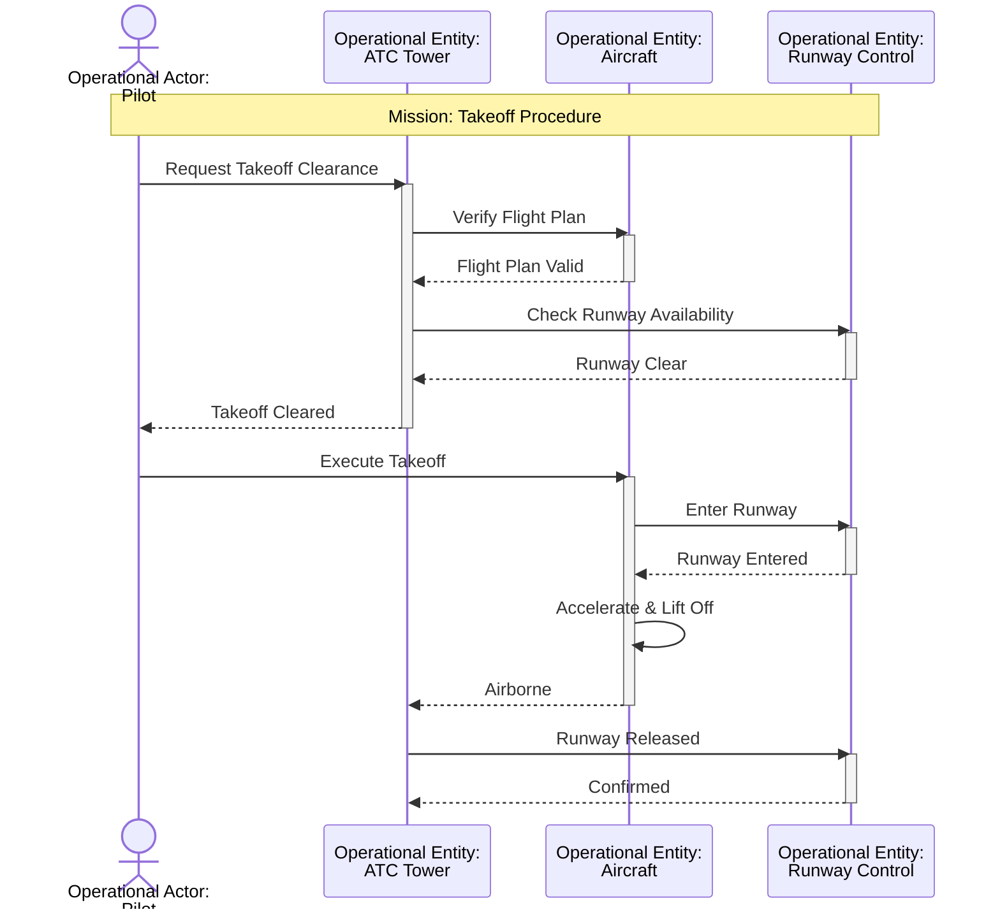

### 2.2 SS — System Scenario (SA Layer)

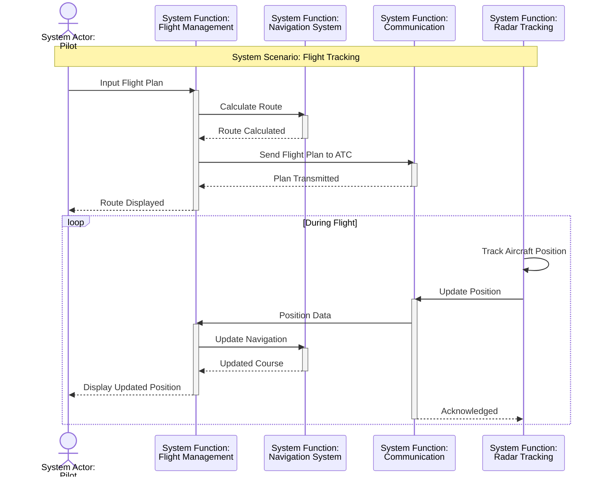

### 2.3 LS — Logical Scenario (LA Layer)

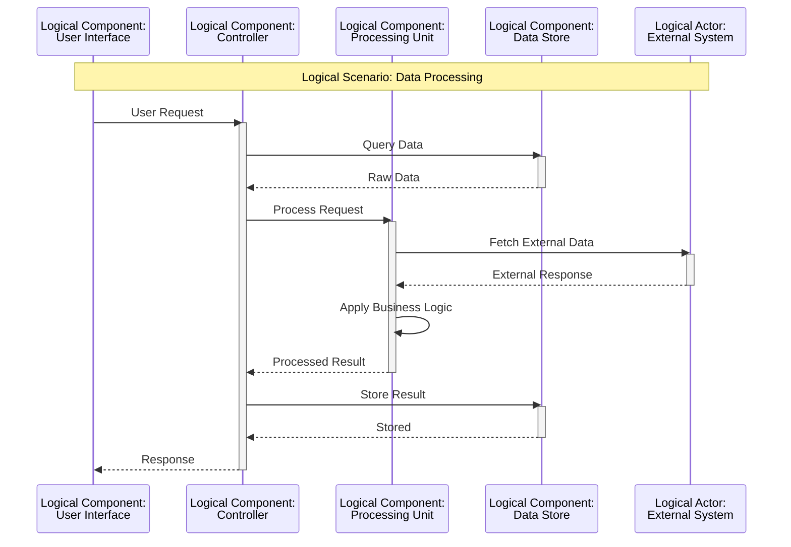

### 2.4 PS — Physical Scenario (PA Layer)

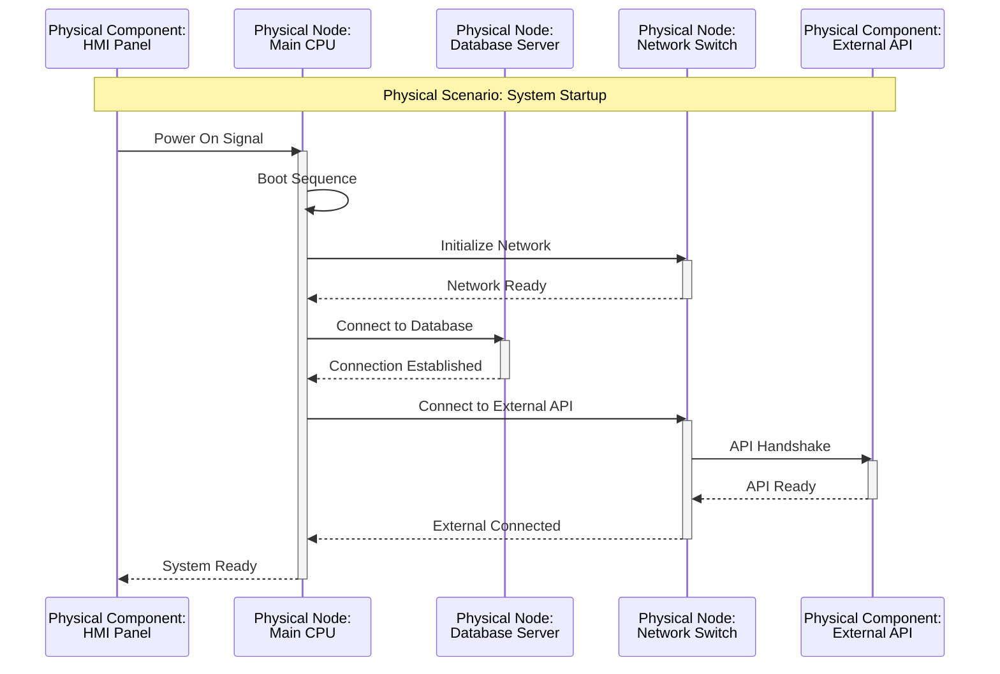

---

## 3. Architecture Blank Diagrams — ARCADIA Component Views

### 3.1 SAB — System Architecture Blank (SA Layer)

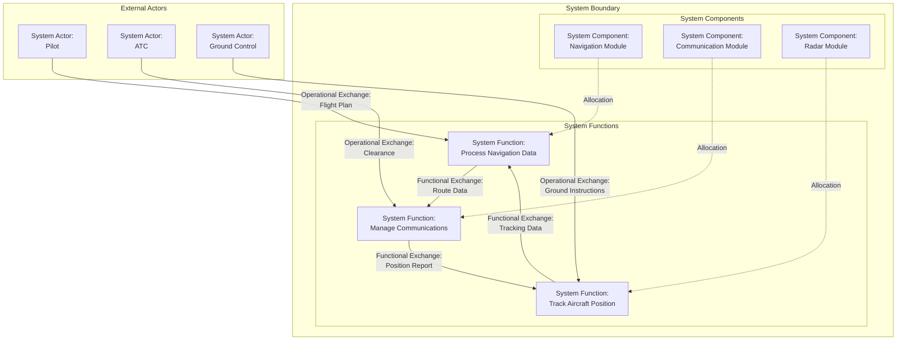

### 3.2 LAB — Logical Architecture Blank (LA Layer)

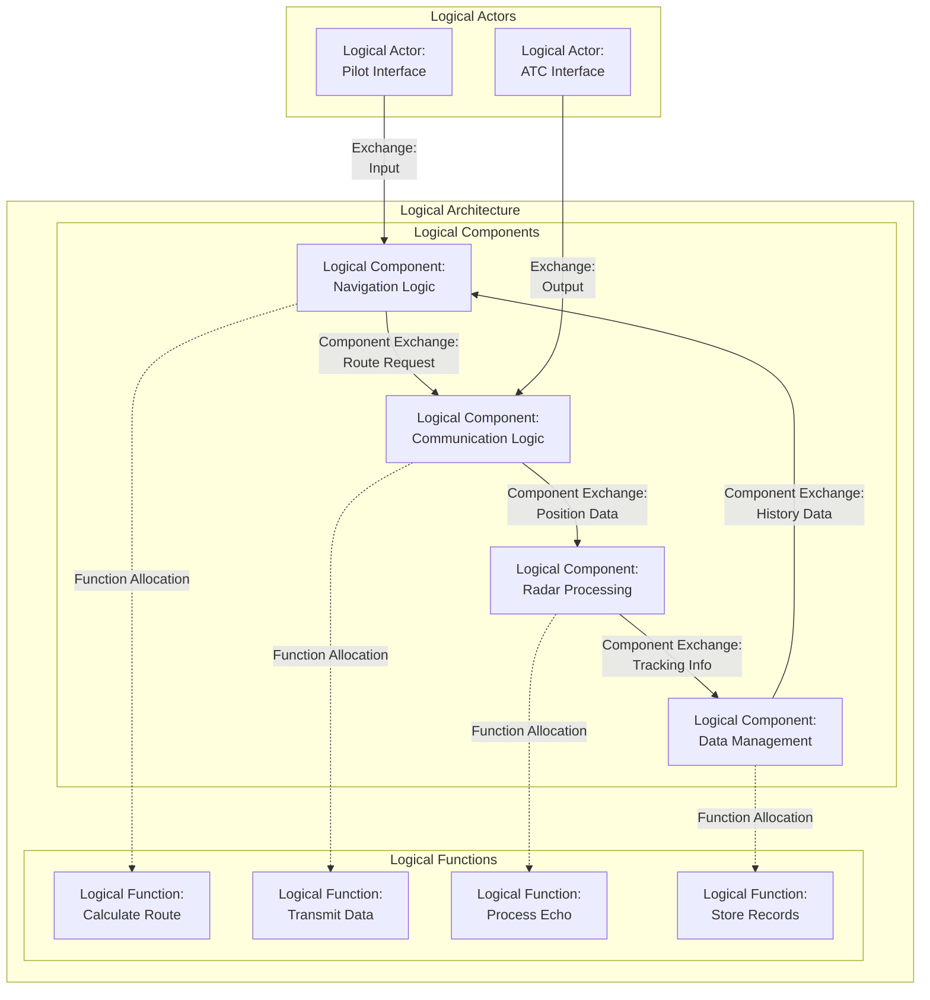

### 3.3 PAB — Physical Architecture Blank (PA Layer)

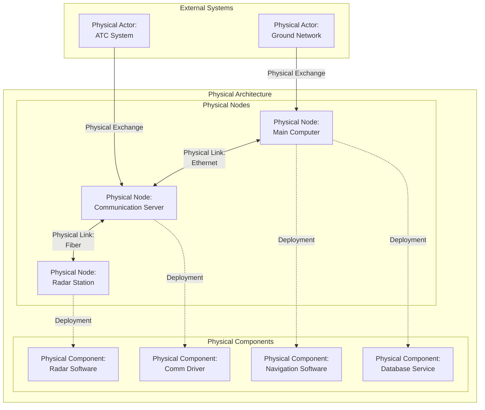

---

## 4. Breakdown Diagrams — ARCADIA Hierarchies

### 4.1 OEB — Operational Entity Breakdown (OA Layer)

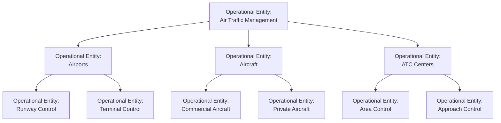

### 4.2 LCB — Logical Component Breakdown (LA Layer)

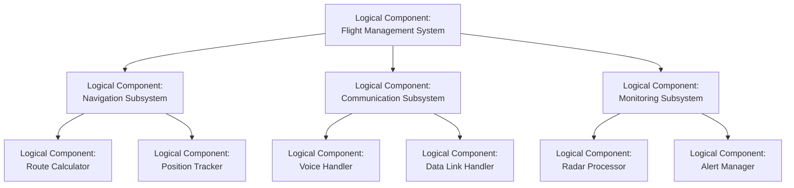

---

## 5. Traceability — Cross-Layer Links

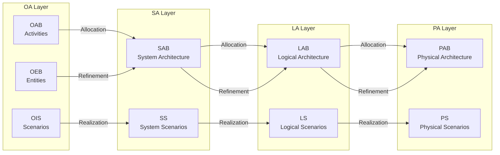

---

*Generated for Arcadia web project — 2026-06-26*
